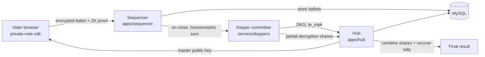

# Permanent private voting (`shutter-elgamal`)

This is the entry point for Snapshot's **permanent private voting** feature. It adds a new proposal
privacy mode, `privacy: 'shutter-elgamal'`, in which every ballot is encrypted in the browser and
**stays encrypted forever** — only the final tally is ever revealed, and not even the Snapshot
backend can decrypt an individual vote.

It is built on **linearly-homomorphic threshold ElGamal over BLS12-381**: voters encrypt their
ballots under a committee master public key, the encrypted ballots are summed homomorphically, and a
committee of independent **keypers** jointly decrypt only the aggregate. With threshold `t = 1, n = 3`,
two honest keypers must cooperate to open a tally and no single keyper (nor the server) can learn
anything about how anyone voted.

> New here? Read this page top-to-bottom, then jump to [running-locally.md](running-locally.md) to
> bring the stack up.

---

## How it works (end to end)

1. **Key generation (DKG).** When a `shutter-elgamal` proposal is created, the keyper committee runs
   a Feldman-VSS distributed key generation and publishes a single master public key (`te_mpk`) to
   the hub. No party ever holds the full secret key.
2. **Voting.** The browser encrypts the ballot under `te_mpk` using the
   [`@snapshot-labs/private-vote-sdk`](../../packages/private-vote-sdk), attaches a zero-knowledge
   proof that the ballot is well-formed (range + budget), and signs it with the voter's wallet
   (EIP-712). The sequencer verifies every ballot at ingest time.
3. **Tally.** After the proposal closes, the sequencer homomorphically sums the ciphertexts and the
   keypers each publish a partial decryption share (with a DLEQ proof). The hub combines `t+1` shares
   via Lagrange interpolation and recovers the plaintext totals (baby-step-giant-step). Individual
   ballots are never decrypted.

---

## Where the code lives

| Component | Path | Role |
| --- | --- | --- |
| Client crypto SDK | [packages/private-vote-sdk](../../packages/private-vote-sdk) | Ballot construction, ZK proofs, ballot/share verification, tally recovery. TS, BLST WASM. |
| Hub | [apps/hub](../../apps/hub) | GraphQL/REST API. Stores proposals, DKG submissions, decryption shares; finalizes `te_mpk` and the tally. |
| Sequencer | [apps/sequencer](../../apps/sequencer) | Authenticated vote ingestion; verifies each ballot; runs the tally worker on close. |
| Keyper committee | [services/keypers](../../services/keypers) | Python service. Runs DKG and partial decryption. Includes the auto-DKG coordinator. |
| Voter UI | [apps/ui](../../apps/ui) | Builds encrypted ballots locally with the SDK; surfaces the privacy selector. |
| Docker stack | [docker-compose.yml](../../docker-compose.yml) · [docker/](../../docker) | One-command backend (MySQL + hub + sequencer + 3 keypers + auto-DKG). |

---

## Running it

- **[running-locally.md](running-locally.md)** — the run guide. Docker quick-start (recommended) and
  native dev, the end-to-end vote flow, and troubleshooting.
- **[docker/README.md](../../docker/README.md)** — operator guide for the containerized stack.
- **[phase-6-keyper-runbook.md](phase-6-keyper-runbook.md)** — deeper keyper operations.

---

## Crypto parameters (current deployment)

| Parameter | Value |
| --- | --- |
| Curve | BLS12-381 (ElGamal in G₂, Schnorr in G₁) |
| Threshold | `t = 1, n = 3` (two honest keypers required to open a tally) |
| Ballot variant | Variant A, exact budget `B = 1` |
| DKG | Feldman verifiable secret sharing |
| Parity gate | TS↔Python byte-for-byte, `scripts/parity-gate.mjs` |

---

## Further reading

- [running-locally.md](running-locally.md) — Local run guide (Docker + native)
- [phase-6-keyper-runbook.md](phase-6-keyper-runbook.md) — Keyper deployment runbook
- [phase-10-threat-model.md](phase-10-threat-model.md) — Threat model & adversary analysis
- [phase-11-validation-status.md](phase-11-validation-status.md) — What has and hasn't been validated
- [packages/private-vote-sdk/README.md](../../packages/private-vote-sdk/README.md) — Full SDK API surface
</content>
</invoke>
