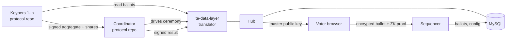

# Permanent private voting (`shutter-elgamal`)

> **Alpha.** The UI surfaces an "Alpha" tag on the **Permanent private voting** privacy option.

The entry point for Snapshot's **permanent private voting**: a proposal privacy mode,
`privacy: 'shutter-elgamal'`, in which every ballot is encrypted in the browser and **stays
encrypted forever**. Only the final tally is ever revealed, and the Snapshot backend cannot decrypt
an individual vote at any point — not during voting, not after, not with its database.

It is built on **linearly-homomorphic threshold ElGamal over BLS12-381**. Voters encrypt under a
committee master public key, the ciphertexts are summed homomorphically, and a committee of
independent **keypers** jointly decrypt only the sum.

**Snapshot does not run the committee.** The keypers and their coordinator are the
[generalised-el-gamal][geg] protocol's own services, run by separate operators; this repository is
the data layer they read ballots from and write results to. That split is the security property —
see [`architecture.md`](./architecture.md) for why, and [`architecture-legacy.md`](./architecture-legacy.md)
for the single-writer design it replaced.

[geg]: https://github.com/shutter-network/generalised-el-gamal

---

## Contents

- [How it works](#how-it-works)
- [Where the code lives](#where-the-code-lives)
- [Crypto parameters](#crypto-parameters)
- [Running it](#running-it)
- [Lifecycle of a proposal](#lifecycle-of-a-proposal)
- [Security model](#security-model)
- [Operational rules worth knowing](#operational-rules-worth-knowing)
- [Troubleshooting](#troubleshooting)
- [Reference](#reference)

---

## How it works

```mermaid
flowchart LR
    A[Voter browser] -->|encrypted ballot + ZK proof| S[Sequencer]
    S -->|ballots, config| DB[(MySQL)]
    H[Hub] --- DB
    H -->|master public key| A
    L[te-data-layer<br/>translator] --- H
    C[Coordinator<br/>protocol repo] -->|drives ceremony| L
    K[Keypers 1..n<br/>protocol repo] -->|read ballots| L
    K -->|signed aggregate + shares| C
    C -->|signed result| L
```

1. **Key generation.** When a private proposal is created, the sequencer freezes the committee onto
   it and the coordinator drives a Feldman-VSS distributed key generation. The keypers publish a
   single master public key (`te_mpk`); no party ever holds the full secret. This must complete
   **before voting opens** — a key that arrives later cannot match the ballots, so the proposal is
   terminally dead rather than merely late.
2. **Voting.** The browser encrypts under `te_mpk`, attaches a zero-knowledge proof that the ballot
   is well-formed (per-candidate range plus an exact budget), signs it with the voter's wallet
   (EIP-712), and carries an eligibility credential minted by the hub binding that ballot's voting
   power. The sequencer verifies every ballot at ingest.
3. **Aggregation.** After close, **every keyper independently re-derives** the voting-power-weighted
   sum from the same ordered ballots and submits it signed. The artifact becomes canonical only when
   a quorum submits it **byte-identically**.
4. **Decryption.** Each keyper publishes a partial decryption share with a DLEQ proof. The
   coordinator recovers the plaintext totals by Lagrange interpolation and baby-step-giant-step,
   signs them, and publishes. The hub verifies the signature; the sequencer mirrors the scores.

Step 3 is the one that changed, and it is the point of the whole design. The sequencer used to sum
the ballots alone, which meant isolating one voter's ballot required compromising one process.
Now it requires corrupting a majority of the committee.

A voter with voting power `N` is counted `N` times by scaling their ciphertexts by `w = round(vp)`
before the sum — no change to the ballot cryptography. A ballot with `vp < 0.5` rounds to weight 0
and is excluded, deterministically, by every keyper alike.

---

## Where the code lives

| Component | Path | Role |
| --- | --- | --- |
| Client crypto SDK | `@shutter-network/urban-verified-crypto` | Ballot construction, ZK proofs, verification, tally recovery. Published package, BLST WASM. |
| Hub | [apps/hub](../../apps/hub) | GraphQL/REST. Storage of record for ballots, DKG results, aggregates, shares, results. Verifies every protocol write. |
| Sequencer | [apps/sequencer](../../apps/sequencer) | Vote ingestion and ballot verification; freezes the committee onto each proposal; mirrors published totals into `scores`. |
| Translator | [apps/te-data-layer](../../apps/te-data-layer) | Presents the hub to the protocol as its data layer, over the port contract. |
| Voter UI | [apps/ui](../../apps/ui) | Builds encrypted ballots locally; the verify-tally panel; the stall notice and admin retry. |
| Cross-language vectors | [packages/geg-parity](../../packages/geg-parity) | TS ⇄ Python parity for the crypto primitives. |
| Committee | **not in this repo** | Keypers and coordinator live in the protocol repository, run by independent operators. |

---

## Crypto parameters

| Parameter | Value |
| --- | --- |
| Curve | BLS12-381 (ElGamal in G₂, Schnorr in G₁) |
| Threshold | `t = 2, n = 3` — `t` is the **quorum**, the number of keypers required |
| Ballot variant | Variant A, exact budget `B = 1` (single-choice) or `B = 100` (weighted) |
| DKG | Feldman verifiable secret sharing |
| Write authorisation | `GEG-DKG-RESULT-v1`, `GEG-AGGREGATE-v1`, `GEG-DECRYPT-SHARE-v1`, `GEG-RESULT-v1`, wrapped in `GEG-REQUEST-v1` |
| Digest parity | Vectors generated by the protocol's Python, in `apps/hub/test/fixtures/geg-*.json` |

**On the threshold notation.** `t = 2, n = 3` and "2-of-3" mean the same thing: two keypers must
cooperate. Older notes in this directory say `t = 1, n = 3` for the same committee, counting
tolerated faults instead of the required quorum. Mixing the two is what produces a config rejected
as *"threshold must be a majority"*.

---

## Running it

See **[`RUNNING.md`](../../RUNNING.md)** at the repository root — a copy-paste walkthrough covering
both repositories: every environment file, both stacks, creating a proposal, voting, and watching
the tally publish.

The three "Running it" sections that used to be here described a compose file that started the
committee alongside Snapshot's services. That arrangement gave one `docker compose up` the power to
read every ballot, and it no longer exists.

---

## Lifecycle of a proposal

| Stage | What must be true |
| --- | --- |
| Creation | Opens at least `MIN_DKG_LEAD_TIME_S` (180s) ahead; every keyper reachable, since the sequencer resolves the committee from each `/status` |
| DKG | Needs **every** member, not a quorum. Failure is terminal at `voting_start` |
| Voting | `te_mpk` present; each ballot verified at ingest and carrying an eligibility credential |
| Aggregation | Past `votingEnd`; a quorum of byte-identical artifacts makes one canonical |
| Decryption | A canonical aggregate exists; shares are DLEQ-verified against it |
| Result | Signed by the coordinator, verified against the frozen `resultPublisherAddress` |
| Mirror | The sequencer divides by the budget and writes `scores`, `scores_state = 'final'` |

Two states are worth naming because they are visible to users:

- **Stalled** — the committee could not finish. Persisted, so a coordinator restart does not resume
  it; an admin clears it from the proposal page. The two directions are signed by different
  identities on purpose (§8 of `architecture.md`).
- **DKG failed** — voting opened with no key. Terminal, and **derived on read** rather than stored:
  `privacy ∧ ¬te_mpk ∧ now > start`.

---

## Security model

Threshold `t = 2, n = 3`: two keypers must cooperate to open a tally; one alone learns nothing.

| Adversary | Outcome |
| --- | --- |
| Network observer (passive) | Freshly-randomised ciphertexts and public signatures. The candidate vector is information-theoretically masked. No exposure beyond Snapshot's existing voter↔proposal links. |
| Single malicious keyper | Holds 1 of 3 shares — learns nothing. Malformed shares are caught by the DLEQ proof, re-run by the "Verify tally" button. |
| Two colluding keypers | Can decrypt the per-candidate **aggregate** only. Individual ballots are never decrypted by anyone. |
| Malicious hub or sequencer | Cannot forge ballots (Schnorr + EIP-712), cannot decrypt, and **cannot produce the canonical aggregate** — it only records what keypers submit and promotes what a quorum agrees on. Hiding a ballot now requires corrupting a majority of the committee. |
| Ballot stuffing | The budget proof requires the ciphertext sum to encrypt exactly `B`. Over-budget ballots fail verification at ingest. |
| Replay across proposals | Each ballot binds the proposal id into `electionId` and `pseudonym = keccak256(voter ‖ proposalId)`. |
| Deleting an inconvenient tally | Refused: a private proposal cannot be deleted once `start` has passed, by anyone — author, moderator or admin (§12.1 of the plan). |
| Long-term key compromise | Forward secrecy is per-proposal; each proposal runs a fresh DKG. |

**Out of scope:** DoS and availability, host side-channels, coercion resistance, and quantum
adversaries (BLS12-381 confidentiality is post-quantum-vulnerable, as with every BLS12-381 system).

**Known limitation — committee discovery.** `TE_KEYPERS` holds URLs; each address is read from that
keyper's `/status` once per sequencer process and frozen into the proposal. Over HTTPS the
certificate anchors that identity; over plain HTTP the network path does. Use HTTPS keyper URLs in
any real deployment. This narrows the old member-list MITM (F4) rather than closing it — the full
argument is in §5.2 of [`geg-integration-plan.md`](./geg-integration-plan.md).

**Operator policy:** three keypers run by three independent organisations, each holding its own
signing key and its own encrypted state directory. A keyper that produces a verification failure
during an audit is removed from the committee before the next proposal.

---

## Operational rules worth knowing

Each of these has produced a confusing failure at least once:

- **A keyper must be reachable when a private proposal is created**, because the committee is
  resolved then. It fails loudly at creation rather than producing a proposal that dies later.
- **Two keyper URLs must not report the same address.** A committee of "3" that is really 2 keys
  makes `t = 2` satisfiable by one operator. Refused at creation.
- **`GEG_API_URL` on a keyper is a base URL** — it appends `/port` itself. Including the suffix
  yields `/port/port` and every read 404s.
- **Losing a keyper's state directory loses its share.** If that puts the committee below quorum,
  those elections can never be decrypted, by anyone.
- **A private proposal is permanent once voting opens** — it cannot be deleted. Moderators keep
  `flag-proposal`, which hides content without destroying the record.
- **Editing is allowed until `start`**, including inside the DKG lead-time window once the key
  exists.

---

## Troubleshooting

- **"proposal does not yet have a finalised threshold key"** → the DKG has not completed. If
  `start` has already passed it never will; the proposal is terminally dead and the UI shows a DKG
  failure notice.
- **Proposal stuck on "Finalizing results"** → the scores endpoint was never called or could not be
  reached. `curl -sL localhost:3000/api/scores/<id>` should return `{"result":true}`; if the redirect
  target is not resolvable from a browser, fix `SEQUENCER_PUBLIC_URL`.
- **`TE_KEYPERS entry "…" looks like "address@url"`** → the config takes URLs only now; addresses are
  read from `/status`.
- **Tally stalled** → the notice names three possible causes and asserts none, because the stored
  flag is a boolean. Which one it was is in the coordinator's log: `grep abandoned`.
- **Committee writes rejected as `not_a_registered_keyper`** → the address recovered from the
  signature is not in the proposal's frozen config. Usually a keyper key rotated after the proposal
  was created; the frozen config is deliberately immutable.

---

## Reference

- [`architecture.md`](./architecture.md) — topology, trust boundaries, storage of record, lifecycle.
- [`architecture-legacy.md`](./architecture-legacy.md) — the single-writer design this replaced, kept
  for the security-flaw lineage.
- [`geg-integration-plan.md`](./geg-integration-plan.md) — the decision record: what changed, why,
  and what each choice costs.
- [`geg-integration-issues.md`](./geg-integration-issues.md) — the issue breakdown and its status.
- [`RUNNING.md`](../../RUNNING.md) — running the whole system, both repositories.
