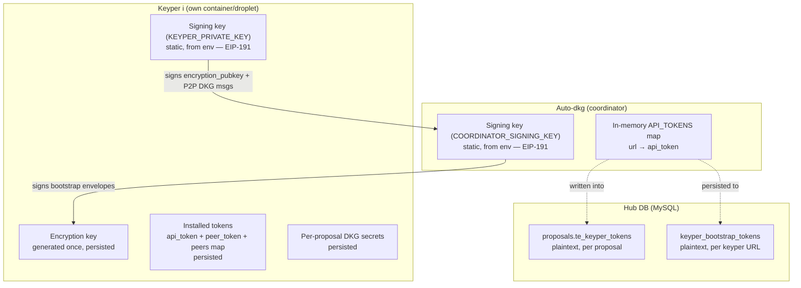
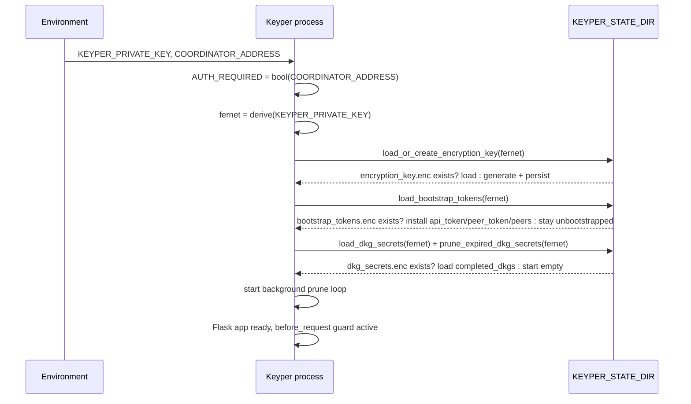
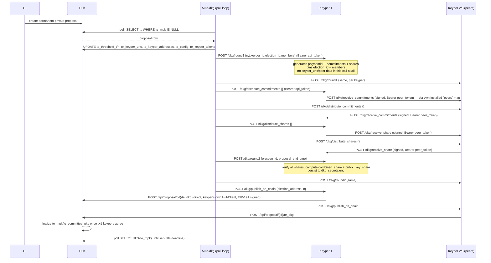
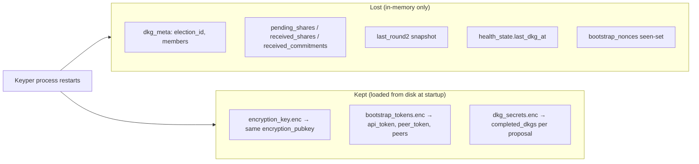
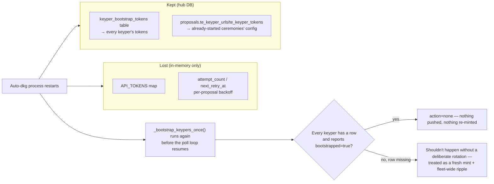

# Keyper ↔ Auto-DKG System Flows

A single, ordered walkthrough of everything that happens between a keyper, auto-dkg, the
hub, and the sequencer — from cold start through a DKG ceremony, decryption, and every
restart scenario. This doc describes the *current, as-implemented* behavior.

Source of truth for every claim here: `services/keypers/src/{keyper.py, auto_dkg.py,
dkg_coordinator.py, keyper_persistence.py, token_bootstrap.py}`.

---

## 1. Actors and identities



| Identity | Held by | Purpose |
|---|---|---|
| `KEYPER_PRIVATE_KEY` | Each keyper | Signs P2P DKG messages, signs its own `encryption_pubkey`, signs hub submissions |
| Encryption keypair (X25519) | Each keyper, generated | Decrypts `/auth/bootstrap` payloads |
| `COORDINATOR_SIGNING_KEY` | Auto-dkg | Signs bootstrap envelopes so keypers can verify authenticity |
| `COORDINATOR_ADDRESS` | Every keyper (config) | Pinned value keypers verify bootstrap signatures against |

`COORDINATOR_SIGNING_KEY` and `COORDINATOR_ADDRESS` must be deployed together — set both or
neither. Empty on either side = single-operator dev mode, `AUTH_REQUIRED = False`, no
bearer-token checks anywhere.

### Why `KEYPER_ID` is not just a label

The coordinator assigns each keyper's id purely by position in `KEYPER_URLS`
(`Keyper(kid=i+1, url=...)`, `dkg_coordinator.py`) — it never asks a keyper what its id is.
That id is then a real cryptographic input, not metadata: it's the x-coordinate this
keyper's Feldman-VSS share is evaluated at, the index `_members_addr(dealer_id)` looks up
when verifying a P2P signature, and the `keyper_index` reported to the hub for Lagrange
reconstruction during tally recovery. So a keyper's own `--id`/`KEYPER_ID` must equal
whatever position the hub operator gave its URL in `KEYPER_URLS`.

Misconfiguring it — wrong value, or two keypers sharing one — always fails safe rather than
silently corrupting anything: `/dkg/round1` checks `keyper_id != keyper_meta["id"]` on every
call and rejects with a 400 identifying the exact mismatch, which aborts that ceremony
immediately (no per-keyper isolation in `run_dkg()`'s round1 loop, so one bad id fails the
whole ceremony, not just that keyper's part). Even without that check, a wrong id would
independently fail P2P signature verification — a keyper's real key always signs as its
*configured* `dealer_id`, and every recipient checks that signature against
`members[dealer_id - 1]`; a wrong id means that lookup returns some other keyper's address,
which can never match. Two independent layers, same failure mode either way: a loud,
immediate, clearly-logged DKG failure — never a wrong or silently-accepted result.

---

## 2. Keyper startup

Runs once per process start, in `create_keyper_app()`, in this exact order:



If `bootstrap_tokens.enc` didn't exist (first-ever start), the keyper is now live but
**fails closed** on every route except `/status`, `/health`, `/auth/bootstrap` — see
§6a for what "fails closed" means precisely.

---

## 3. Auto-dkg startup + bootstrap reconciliation

Runs once, in `run_forever()`, **before** the poll loop begins — `_bootstrap_keypers_once()`.
No periodic timer; see §6b/§6c for how restarts and forced rotation re-enter this same path.

Note: this pass makes up to **three separate `GET /status` round trips** per keyper via
three independent helper functions (`fetch_members_from_status`, `fetch_bootstrapped_status`,
`fetch_encryption_pubkeys`) — not one shared fetch. Shown accurately below, not collapsed.

```mermaid
sequenceDiagram
    participant A as Auto-dkg
    participant DB as MySQL (keyper_bootstrap_tokens)
    participant K as Each keyper

    A->>K: GET /status  (fetch_members_from_status)
    K-->>A: address
    A->>DB: SELECT keyper_url, api_token, peer_token
    DB-->>A: existing rows

    alt any keyper URL missing a row
        A->>A: mint fresh (api_token, peer_token) for missing keyper(s)
        A->>A: target = every keyper (peers map depends on the full set)
    else no rows missing
        A->>K: GET /status  (fetch_bootstrapped_status, separate call)
        K-->>A: bootstrapped flag
        A->>A: target = keypers reporting bootstrapped=false
    end

    opt target set non-empty
        A->>K: GET /status  (fetch_encryption_pubkeys, separate call again)
        K-->>A: encryption_pubkey, encryption_pubkey_sig
        A->>A: verify sig recovers to address
        loop each target keyper i
            A->>A: build peers = {other kid: {url, token}} for j != i
            A->>A: payload = {intended_recipient, api_token, peer_token, peers, nonce, timestamp}
            A->>A: sig = sign(payload, COORDINATOR_SIGNING_KEY)
            A->>A: sealed = x25519_seal({payload, sig}, keyper_i_encryption_pubkey)
            A->>K: POST /auth/bootstrap  (body: sealed bytes)
            K->>K: unseal, verify sig == COORDINATOR_ADDRESS, verify intended_recipient, verify nonce/timestamp fresh
            K->>K: install api_token/peer_token/peers; persist to bootstrap_tokens.enc
            K-->>A: 200 ok
        end
        A->>DB: upsert rows for any newly-minted keyper(s)
        A->>DB: resync te_keyper_tokens for every open proposal (see §3a)
    end
```

**§3a — per-proposal resync detail.** Only runs if at least one keyper was missing a row
(a genuine mint happened). For each proposal with `te_mpk IS NOT NULL AND scores_state !=
'final'`, reads *that proposal's own* `te_keyper_urls` and rebuilds its `te_keyper_tokens`
array via an `API_TOKENS` lookup keyed by URL — never assumes the current global
`KEYPER_URLS` order applies to an older proposal, since committee membership/order could
have changed since that proposal's DKG ran.

**Failure handling:** a keyper that's unreachable during this pass still gets its intended
token written to `keyper_bootstrap_tokens` (so the next auto-dkg restart's reconciliation
finds the row present, `bootstrapped=false`, and retries with the same value) — but there's
no automatic retry until that next restart.

---

## 4. DKG ceremony (per proposal)



Two structural guarantees worth naming explicitly:
- **No destination data crosses in any DKG call's body.** `round1`, `distribute_commitments`,
  and `distribute_shares` never carry `keyper_urls` — each keyper fans out P2P calls using
  only its own bootstrap-installed `peers` map. A leaked `api_token` cannot be used to
  redirect a share, because there's no caller-suppliable destination to redirect.
- **The hub submission is direct, not relayed.** `publish_on_chain` and the decrypt-share
  submission (§5) are each keyper calling the hub itself via its own `KEYPER_HUB_URL` +
  `HubClient`, signed with its own key — auto-dkg only ever tells the keyper *to* publish,
  never publishes on its behalf.

---

## 5. Decrypt / tally flow

```mermaid
sequenceDiagram
    participant Voter
    participant Seq as Sequencer
    participant Hub
    participant K as Each keyper

    Voter->>Hub: encrypted ballot (te_config validated at write time)
    Seq->>Seq: tally tick: aggregateBallots() homomorphically
    Seq->>Hub: UPDATE te_aggregate
    Seq->>Seq: read te_keyper_urls[i] + te_keyper_tokens[i] from the proposal row

    loop each keyper i
        Seq->>K: POST /decrypt/publish_on_chain {proposal_id}  (Bearer te_keyper_tokens[i])
        Note over Seq: logs attempt + outcome either way (te.ts triggerKeypers)
        K->>Hub: GET /api/proposal/{id}/te_aggregate  (own HubClient)
        K->>K: compute partial decryption share + DLEQ proof per candidate
        K->>Hub: POST /api/proposal/{id}/te_decryption_share  (own HubClient, signed)
    end

    Seq->>Hub: SELECT share rows; wait for t+1 per candidate
    Seq->>Seq: recoverTally() once enough shares -- Lagrange + BSGS
    Seq->>Hub: UPDATE scores, scores_state='final'
```

`te_keyper_tokens[i]` here is the **same coordinator-tier token** auto-dkg itself uses — not
a narrower one. Accepted deliberately: auto-dkg and the sequencer are operated by the same
party, so this isn't crossing the cross-organization trust boundary bearer tokens exist to
protect in the first place (unlike a keyper, which is run by an independent operator).

---

## 6. Restart flows

### 6a. Keyper restart



Net effect: a restarted keyper is **immediately** able to be called (has its `api_token`/
`peer_token` back) and to call others (has its `peers` map back) — **zero** network round
trips needed. `/status` reports `bootstrapped: true` right away, with the *same*
`encryption_pubkey` as before the restart (this is why auto-dkg's cached pubkey never goes
stale across a normal keyper restart).

If the restart happened mid-ceremony, the lost `dkg_meta`/`pending_shares`/etc. means the
*next* call in that ceremony's sequence fails (e.g. `distribute_commitments` returns
`"Run /dkg/round1 first"`). That failure propagates to auto-dkg's existing per-proposal
retry/backoff (`_on_failure`), which restarts the whole ceremony from `round1` — which is
idempotent by design (always clears and re-pins state), so this self-heals without any
restart-specific recovery code.

### 6b. Auto-dkg restart



`API_TOKENS` is rebuilt from `keyper_bootstrap_tokens` (not re-minted) as the very first
step of the reconciliation pass, so a normal auto-dkg restart is a no-op from every
keyper's perspective — no bootstrap traffic at all if nothing actually changed.

### 6c. Forced rotation (deliberate, operator-triggered)

```mermaid
sequenceDiagram
    participant Op as Operator
    participant DB as MySQL
    participant A as Auto-dkg
    participant K2 as Keyper 2 (rotated)
    participant K1K3 as Keyper 1 & 3 (unaffected)

    Op->>DB: scripts/rotate_keyper_token.py --keyper-url <keyper2>
    DB->>DB: DELETE FROM keyper_bootstrap_tokens WHERE keyper_url=...
    Op->>A: docker compose restart auto-dkg
    A->>A: _bootstrap_keypers_once(): keyper2's row missing → fresh mint
    A->>K2: push_bootstrap (new api_token, new peer_token, peers map)
    A->>K1K3: push_bootstrap (own values UNCHANGED, but peers["2"].token updated)
    A->>DB: upsert keyper2's new row; resync open proposals' te_keyper_tokens
```

Reuses the exact same "missing row" code path as a brand-new keyper joining — no separate
mechanism. The ripple to keyper 1 & 3 is necessary because their own `peers` maps contain
keyper 2's *old* `peer_token`, which keyper 2 no longer accepts once rotated.

---

## 7. Persistence summary

| What | Where | Encrypted with | Survives |
|---|---|---|---|
| Signing key | env var (`KEYPER_PRIVATE_KEY`) | — (operator-managed) | Everything (never generated/rotated by this system) |
| Encryption keypair | `KEYPER_STATE_DIR/encryption_key.enc` | Fernet, key derived from signing key | Keyper restart |
| Installed `api_token`/`peer_token`/`peers` | `KEYPER_STATE_DIR/bootstrap_tokens.enc` | Same Fernet key | Keyper restart |
| Completed DKG secrets | `KEYPER_STATE_DIR/dkg_secrets.enc` | Same Fernet key | Keyper restart (until `KEYPER_DKG_RETENTION_TIME` prunes it) |
| Every keyper's `api_token`/`peer_token` | `keyper_bootstrap_tokens` (hub DB) | Plaintext (hub DB is the trust boundary) | Auto-dkg restart |
| Per-proposal committee/token snapshot | `proposals.te_keyper_urls`/`te_keyper_addresses`/`te_keyper_tokens` | Plaintext (same trust boundary) | Everything — written once at DKG start, resynced only on a rotation event |
| In-flight ceremony state (`dkg_meta`, `pending_shares`, ...) | Process memory only | — | **Nothing** — lost on either side restarting; self-heals via `round1` retry |
| Auto-dkg's `API_TOKENS`, retry backoff | Process memory only | — | **Nothing** — rebuilt from the DB table on restart |
